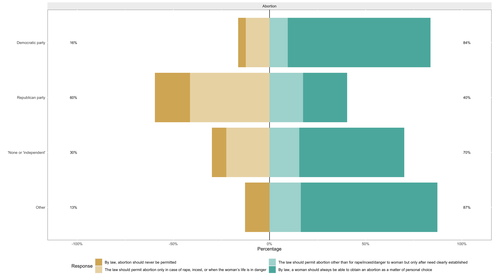
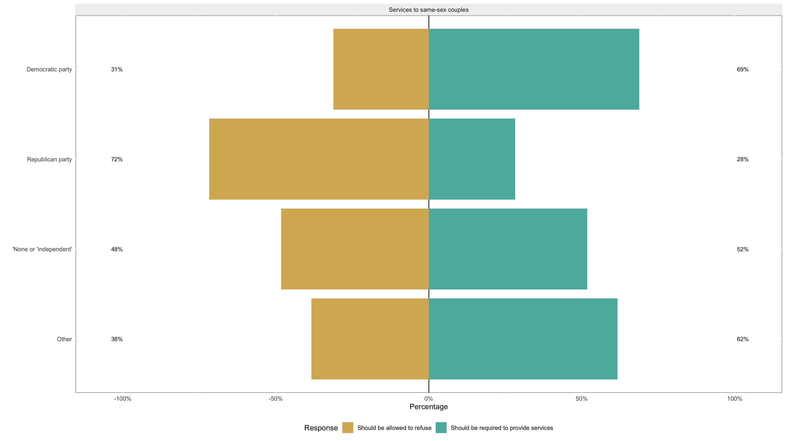

# How Well Will It Work to Pick a Representative from One of Two Parties This Midterm Election?
Andrew Bartnof, Spring 2022

## Background problem
In the upcoming midterm elections, Americans who choose to vote will probably choose between Democratic and Republican representative politicians.
In an ideal world, there'd be a one-to-one mapping between a voter's wishes and their representative's agenda (consider: Bill Clinton voting for Hillary Clinton for POTUS); in a suboptimal world, there'd be barely any similarities at all between a voter and the candidate who comes closest (consider: Karl Marx voting for Hillary Clinton for POTUS; she'd be closer than DJ Trump, but that's not saying much).

This election cycle, do we find that the Democratic/Republican two-party choice does a decent job of representing anybody's true opinions?

## Hypothesis
We should be able to take the results of public opinion polls and find two patterns:
- __Abstract beliefs in a two-party system:__ The multiplicity of individuals' political beliefs should easily align to a single overall dimension (a 'latent variable'), which represents the two-party system that we have.
A single dimension, of course, has two extrema; consequently, we should be able to validate our two-party system by showing that people's political beliefs fall along one latent variable, and no more.
If the ideal number of latent variables is greater than one, then no matter what number we find, we know that the Democratic/Republican two-party system is a gross over-simplification that misrepresents the populous' true beliefs.
- __Social issues in a two-party system:__ If we look at any relevant social issue that divides us, we should find that, once again, Dems and Republicans are at polar opposite extrema of the spectrum of opinions that one can hold.
If this is not true, and we find that Dems and Republicans are not at polar opposite ends of a single spectrum, then there is no way for a voter to find a suitable representative.
(Imagine there was a new bill, the DJ Trump Commemoration Statue; presumably, Dems and Republicans would disagree vociferously on the merits of this bill, and a voter could choose the representative who best mirrors their desires.
On the other hand, imagine voter Jane Doe wanted to make all rivers illegal; there really aren't any political representatives who would suitably represent her, because Dems and Republicans are basically in agreement on rivers.
Consequently, Jane Doe's perspective will not be represented in our government.)

## Methods
Here I analyze data from a recent [American National Election Studies](https://electionstudies.org/about-us/) public research dataset in order to answer these questions.

## Results
### 1. Abstract beliefs in a two-Party System: are two-parties sufficient?
The ANES survey contains several questions which ask respondents to indicate, on a scale from 1 to 7, where they stand on the following abstract issues:
- Liberal/Conservative
- Government should provide many fewer services / Government should provide many more services
- We should greatly decrease defense spending / Greatly increase defense spending
- Government insurance plan / Private insurance plan
- Government should see to jobs and standard of living / Government should let each person get ahead on own
- Government should help Black people / The government should not help Black people
- Tougher regulations on business needed to protect environment / Regulations to protect environment already too much a burden on business

(NB I would not have used the phrasing that the ANES survey used in several of these; consequently, I rephrase them in the text of this writeup, but I use the original phrasing in the diagrams and charts.)

If we use the 'psych' package's parallel test, we can see that _four latent variables_-- not one-- best describe the variance in respondents' endorsements.
This indicates that the one dimension we use, with one of our two major parties on each extrema, is _not sufficient to represent the population's beliefs_.
(NB Please note that I discuss this, as well as all of these statistics, on a national level.
  It is not impossible that if we break out political beliefs into highly local locales, then we would find hyper-local single dimensions that represent all beliefs; but this would then indicate that the Democratic and Republican parties should have as wide a tent as they have locations, which would snap the illusion that there is anything cohesive about their parties.)

#### The view with one latent variable
A factor analysis with one component fits adequately; the root mean square of the residuals is 0.04 sd, and 0.55 of the variance is explained.

Here we can see the loadings (something like correlation coefficients) between our single latent variable and the seven manifest variables.
Most of the loadings are quite high; defense spending has the lowest loading, which indicates that it doesn't correlate as highly as the other beliefs do with our central single dimension, Democrat/Republican.

#### The view with four latent variables
Overfit?
With four latent variables, unsurprisingly, root mean square of residuals is down to 0 sd, and 1.0 of the variance is explained.
We fit a factor analysis using four components and promax oblique rotation, and we've likely over-fit our dataset.

In this diagram, I have emphasized the latent variable that best fits each manifest variable.
Interpretations:
- Component 1: This essentially covers libertarian economics; how much interest does a government have in controlling private industry?
- Component 2: Here we see that, in contrast to the previous model with one component, liberal/conservative and defense spending actually seem to correlate quite well with each other.
- Component 3: I'm not really sure how respondents interpreted the question about Black people, but I suspect that the correlation between these two is the result of various implicit racial biases that respondents have.
Somebody above my pay-grade could delve deeper into this with greater success and elegance than I could.
- Component 4: Interestingly, public/private medical insurance seems to stand alone as a dimension.
This echoes the relatively low loadings that this manifest variable had on the one-component model; it just doesn't jibe well with other political beliefs.

In a weighted public opinion poll, it's difficult to perform analytics using bootstrapped-type statistical tests to aggressively check for over-fit, so we're left with a conditional conclusion:
- If we don't worry about overfit, we can do a much better job of explaining the variance in the respondents' responses if we define them in terms of four dimensions: economics, liberal/conservative, economics and racial justice, and medical coverage.
- If we value brevity, then our single latent variable is adequate; it's not a fiction that it has some explanatory power, but it certainly doesn't capture the lion's share of our beliefs (in this case, it captures about 55% of our beliefs).

## Social Issues

If voters' convictions on the issues are to be mediated by representative politicians, then we ought to find that each of our two parties has a cohesive set of beliefs that is in opposition to the other party's.

(NB I'm talking about the potential for representation here, not at the true value of many people coming together to improve things. That is a different, and better, write-up than the one I'm providing here.)

### Abortion

Republican voters and Democratic voters don't represent two extrema on this issue.
Respondents who indicated that their political affiliation is 'other' held a similar stance as did Democratic respondents, but crucially, they are perhaps more pro-choice than are Democrats.
Respondents who identify as 'None' or 'Independent' are between Democrats and Republicans, but slightly closer to Dems.

### Services to same-sex couples

Ditto; 'Other' fall outside of the Democratic/Republican beliefs.

### Bathroom rights for transgender people

Ditto

### Workplace protections for gay and lesbian people

Ditto again

### Unauthorized immigration

This is our first issue so far where Dems and Republicans are actually on extrema, with 'None'/'Independent' and 'Other' respondents actually in-between the respondents in the big two parties.
Having said this, Republicans are certainly outliers; the other voters are much closer to Democrats.

# Conclusion
The findings here are two-fold:
- If we did not have the cultural baggage that compels us to think of people in terms of the Liberal/Conservative, Democratic/Republican spectrum, we'd probably do better by thinking in terms of a few dimensions.
Given these seven items on the public opinion poll, we did very well with four dimensions.
The single dimension that we overwhelmingly use IRL is easier to visualize than a multi-dimensional model, but it is also less accurate.
- If we just look at respondents' stances on key cultural issues, we see that people who exist outside the two-party system tend to be closer to Dems than to Republicans.
This suggests that, _were the election based exclusively on candidates' positions on these issues_, then Republican candidates would have a more difficult time picking up undecided/misc voters than would Democratic candidates.
